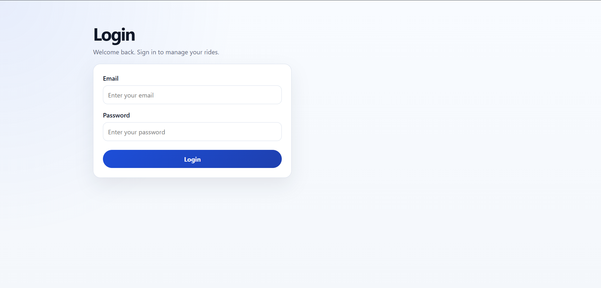
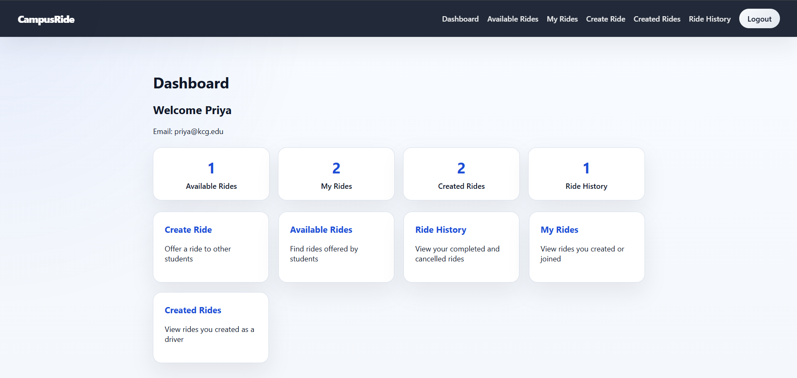
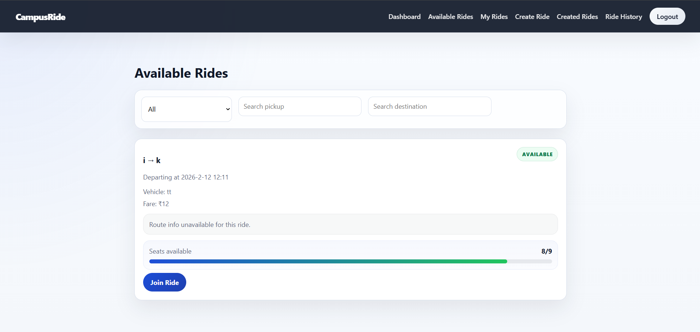
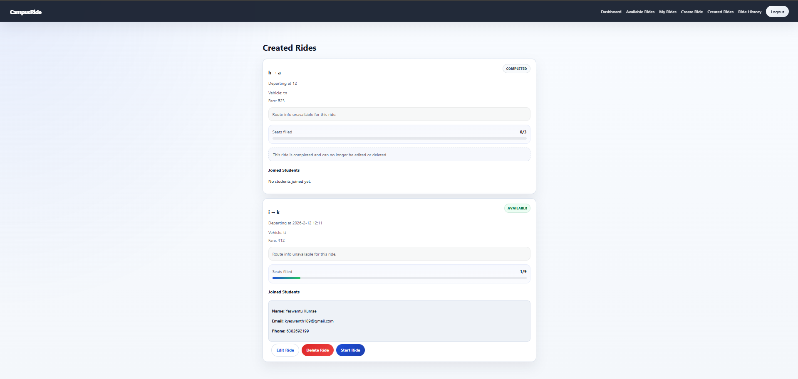

# 🚗 CampusRide

A full-stack **MERN (MongoDB, Express.js, React, Node.js)** web application that enables college students to create, join, and manage ride-sharing within their campus community. CampusRide provides a secure and user-friendly platform for students to find travel companions, reduce transportation costs, and make daily commuting more convenient.

---

## 📌 Features

- 🔐 Secure user authentication using JWT
- 👤 Student registration and login
- 🚘 Create a new ride
- 🔍 View all available rides
- 🤝 Join available rides
- 🚪 Leave joined rides
- ✏️ Edit ride details
- 🗑️ Delete created rides
- 🚦 Update ride status
  - Available
  - Started
  - Completed
  - Cancelled
- 🔎 Search rides by pickup location
- 🔎 Search rides by destination
- 📋 Filter rides by status
- 📱 Responsive and user-friendly interface

---

## 🛠️ Tech Stack

### Frontend
- React.js
- React Router DOM
- Axios
- CSS

### Backend
- Node.js
- Express.js
- JWT Authentication
- bcrypt.js

### Database
- MongoDB
- Mongoose

---

## 📂 Project Structure

```text
CampusRide/
│
├── frontend/
│   ├── src/
│   ├── public/
│   └── package.json
│
├── backend/
│   ├── controllers/
│   ├── middleware/
│   ├── models/
│   ├── routes/
│   ├── config/
│   └── server.js
│
└── README.md
```

---

## 🚀 Installation

### 1. Clone the repository

```bash
git clone https://github.com/your-username/CampusRide.git
```

### 2. Navigate to the project

```bash
cd CampusRide
```

### 3. Install Backend Dependencies

```bash
cd backend
npm install
```

Create a `.env` file inside the backend folder.

```env
PORT=5000
MONGO_URI=your_mongodb_connection_string
JWT_SECRET=your_secret_key
```

Start the backend server.

```bash
npm run dev
```

### 4. Install Frontend Dependencies

```bash
cd ../frontend
npm install
npm run dev
```

The frontend runs on:

```
http://localhost:5173
```

The backend runs on:

```
http://localhost:5000
```

---

## 📡 API Endpoints

### Authentication

| Method | Endpoint | Description |
|--------|----------|-------------|
| POST | `/api/auth/register` | Register a new user |
| POST | `/api/auth/login` | Login user |

### Ride Management

| Method | Endpoint | Description |
|--------|----------|-------------|
| GET | `/api/rides` | Get all available rides |
| POST | `/api/rides` | Create a new ride |
| GET | `/api/rides/created` | Get rides created by the logged-in user |
| GET | `/api/rides/joined` | Get rides joined by the logged-in user |
| PUT | `/api/rides/:id` | Update ride details |
| DELETE | `/api/rides/:id` | Delete a ride |
| POST | `/api/rides/:id/join` | Join a ride |
| POST | `/api/rides/:id/leave` | Leave a ride |
| PATCH | `/api/rides/:id/status` | Update ride status |

---

## 🔒 Authentication

CampusRide uses **JSON Web Token (JWT)** for secure authentication.

After a successful login, the JWT token is stored in the browser and sent with every protected API request.

Example Authorization Header:

```http
Authorization: Bearer <your_token>
```

---

## 📸 Screenshots

Add screenshots of your application here.

### Login Page




### Dashboard



### Available Rides



### Created Rides



---

## 🎯 Future Enhancements

- 🗺️ Google Maps Integration
- 📍 Live Driver Location Tracking
- 🔔 Real-time Updates using Socket.io
- 💬 In-app Chat
- ⭐ Driver & Passenger Ratings
- 📅 Ride History
- 💳 Online Payment Integration
- 📱 Progressive Web App (PWA)

---

## 🌐 Live Demo

🔗 **Frontend:** https://campus-ride-five.vercel.app

---

## 👨‍💻 Author

**Yeswanth Kumar**

GitHub: https://github.com/9124104188-art

LinkedIn:  www.linkedin.com/in/yeswanth189

---

## 📄 License

This project is licensed under the **MIT License**.

---

⭐ If you like this project, don't forget to **Star** the repository!
